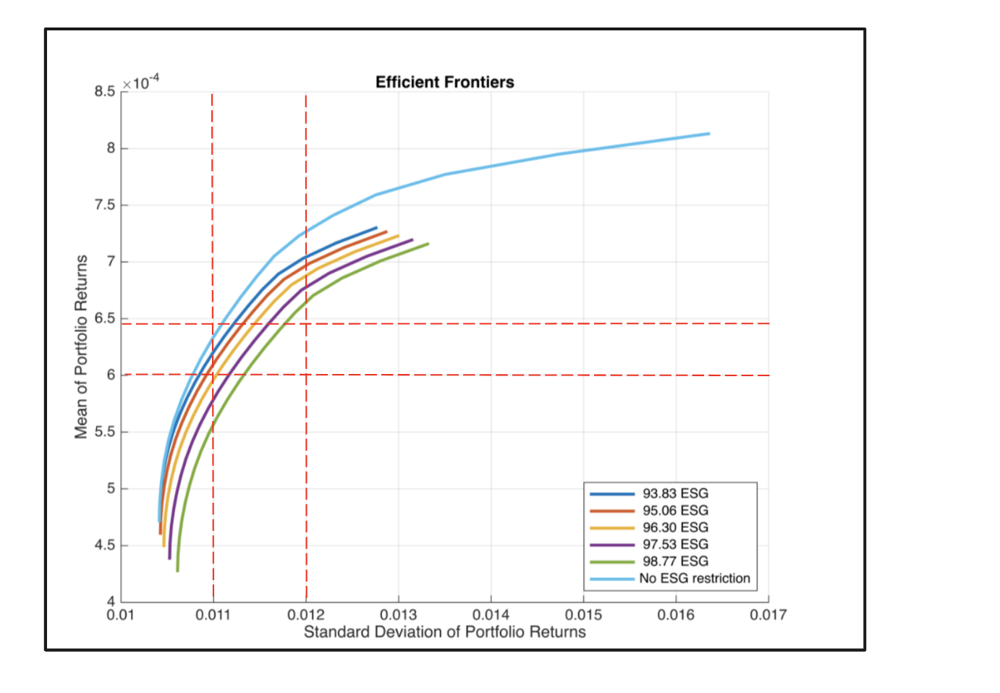
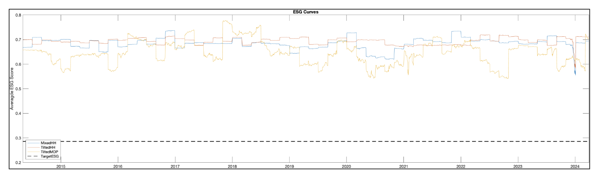

**LLM Advisor for Optimized Portfolios in ESG Investing**

This project develops an ESG-diversified portfolio recommender chatbot in Matlab with some python helper files, equipped with a backtesting engine to evaluate performance. It leverages natural language understanding (NLU) to quantify investor risk and ESG preferences, enabling dynamic portfolio rebalancing on a monthly basis using efficient frontier strategies across five distinct risk and ESG tolerance levels. Most of the NLU portion has been done through integrating MatGPT as our chat interface.  

